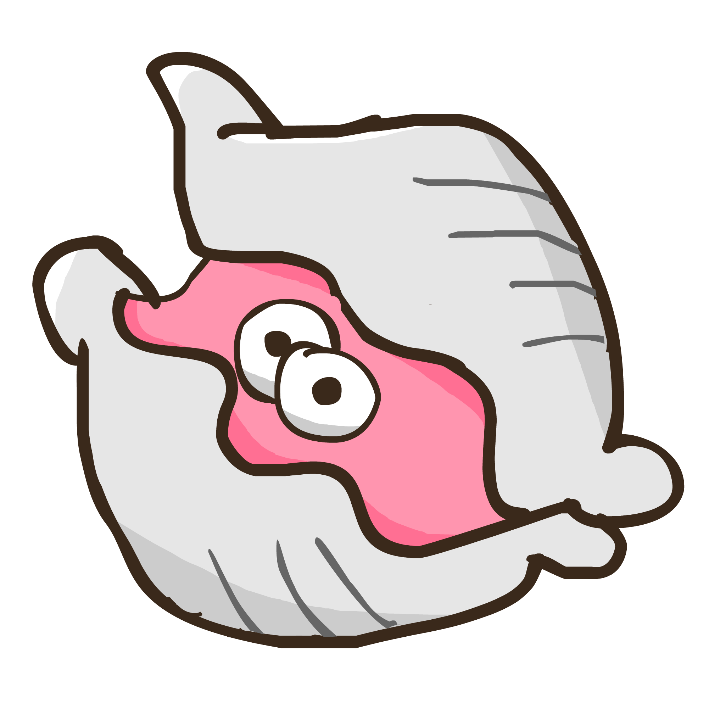

# Clam

My personal Discord bot. Likes to hide in its shell.

Please don't run it yourself.
Source code is only provided for transparency.

Also note that the majority of this codebase contains malformed and generally bad code
that should not be used as an example. See [Rapptz/RoboDanny](https://github.com/Rapptz/RoboDanny)
for a good example.
